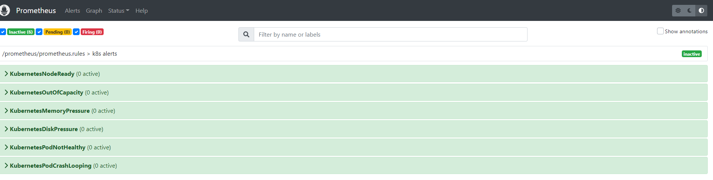
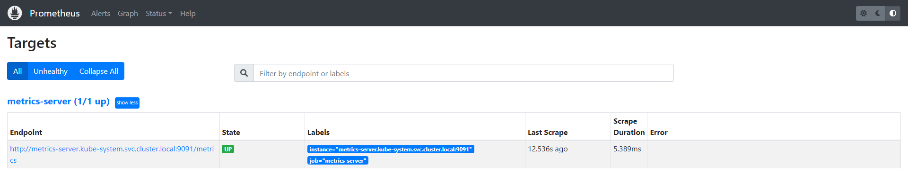
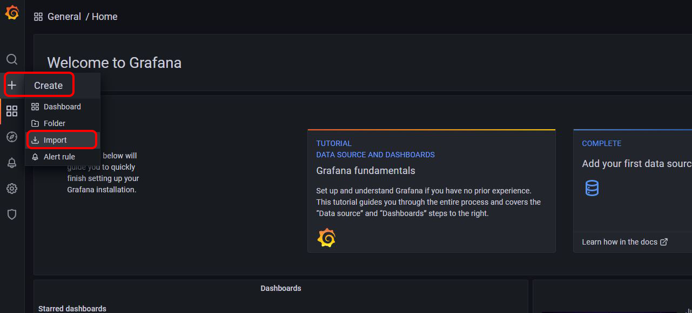
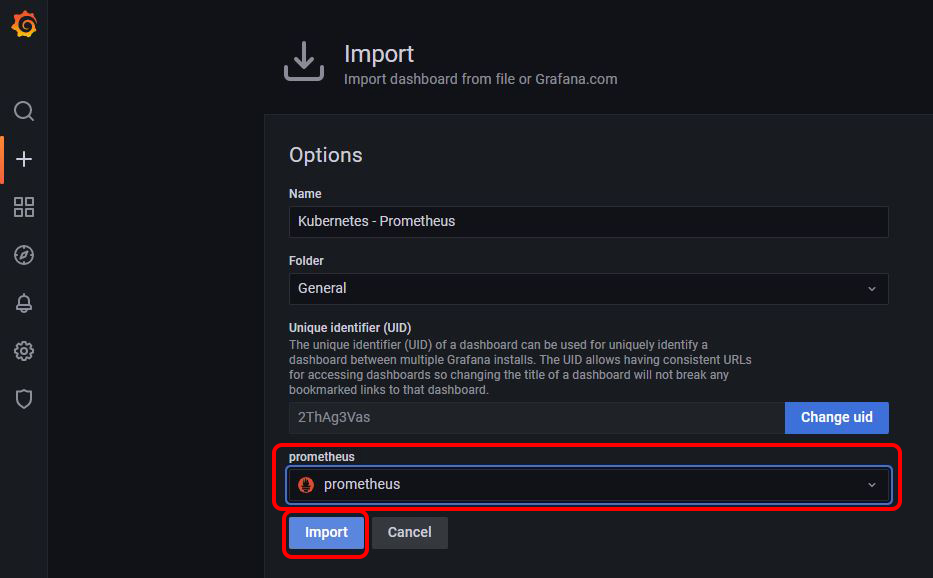
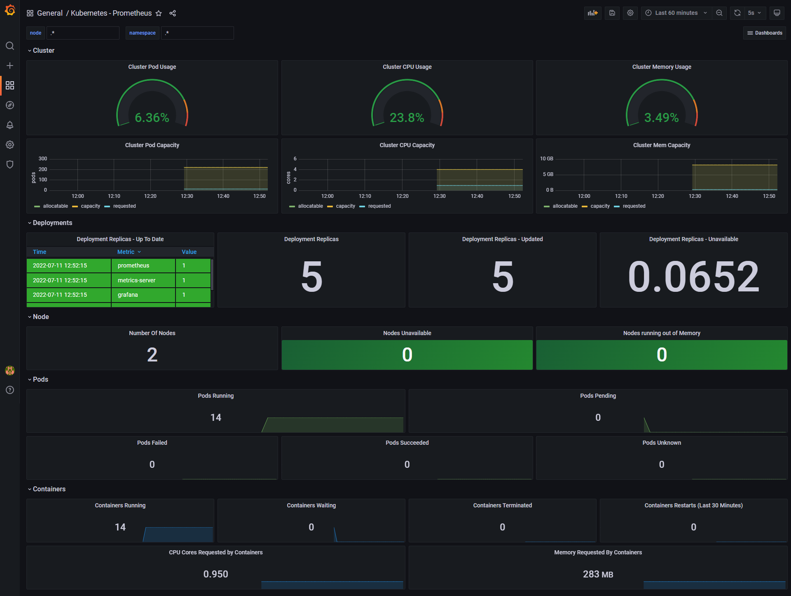

# Deploy the Prometheus-Grafana monitoring stack on a local Kubernetes cluster

Locally create a Kubernetes cluster with minikube and deploy the Prometheus - Grafana monitoring stack with Terraform.


## Technologies Used :fireworks:

- minikube :heavy_check_mark:
- Kubernetes :heavy_check_mark:
- Terraform and Terraform modules:heavy_check_mark:
- Prometheus :heavy_check_mark:
- Grafana :heavy_check_mark:


## Table of Contents :round_pushpin:

- [Requirements](#requirements-pencil)
- [Create the Kubernetes cluster](#create-the-kubernetes-cluster---minikube-zap)
- [Deploy the Kubernetes resources](#deploy-the-kubernetes-resources---terraform-sparkles)
- [Prometheus, Garafana and Alertmanager dashboards](#prometheus-grafana-and-alertmanager-dashboards-desktopcomputer)
- [Grafana dashboard](#grafana-dashboard-barchart)
- [Delete the Kubernetes cluster](#delete-the-kubernetes-cluster-firecracker)


## Requirements :pencil:
1. [minikube](https://minikube.sigs.k8s.io/docs/start/)
    - Install on Linux
      ``` 
      curl -LO https://storage.googleapis.com/minikube/releases/latest/minikube-linux-amd64
      sudo install minikube-linux-amd64 /usr/local/bin/minikube 
      ```
    - Install on Windows (Chocolatey) 
      ``` 
      choco install minikube
      ```
    - Install on macOS
      ```  
      brew install minikube
      ```

2. [Terraform]( https://learn.hashicorp.com/tutorials/terraform/install-cli)
    - Install on Linux
      ``` 
      sudo apt install terraform 
      ``` 
    - Install on Windows (Chocolatey) 
      ``` 
      choco install terraform 
      ``` 
    - Install on macOS
      ```  
      brew install terraform 
      ``` 


## Create the Kubernetes cluster - minikube :zap:

With minikube you can run Kubernetes locally. By default, minikube uses Docker as its driver. However, we take a VM-based approach and set Hyper-V as minikube's driver. 


Kubernetes cluster configuration:
- 2 nodes (a master and a worker node)
- Each node has 2 cpus and 4GB of memory
- Kubernetes will run containers with containerd (NOT Docker)


1. Create the Kubernetes cluster

    ```
    > minikube start --driver=hyperv  --container-runtime=containerd --memory 4048  --cpus 2 -n 2
    ``` 


2. Check the status of Kubernetes nodes and services with both minikube and kubectl

    ```
    > minikube status
    minikube
    type: Control Plane
    host: Running
    kubelet: Running
    apiserver: Running
    kubeconfig: Configured

    minikube-m02
    type: Worker
    host: Running
    kubelet: Running
    ```
    ``` 
    > kubectl get nodes  
    NAME           STATUS   ROLES           AGE     VERSION
    minikube       Ready    control-plane   2m32s   v1.24.1
    minikube-m02   Ready    <none>          65s     v1.24.1
    ``` 


`Note:` If you are running minikube with Hyper-V on Windows, you will probably need administrator privileges.

## Deploy the Kubernetes resources - Terraform :sparkles:
Terraform is an infrastructure-as-code tool which we will use to efficiently deploy the Prometheus - Grafana monitoring stack on Kubernetes. We created Terraform modules for Prometheus, Alertmanager and Grafana.

The Terraform code creates the following Kubernetes objects:
- `Namespace` - This namespace is used to deploy all components of the monitoring stack. Its default name is "monitoring", but it can easily be changed.

- For Prometheus
  - `ClusterRole and ClusterRoleBinding` - To grant get, list, and watch permissions to nodes, pods, services and endpoints within monitoring namespace and allow get requests to the non-resource endpoint /metrics.
  - `configMap` - Both for Prometheus configurations (such as global scraping configuration) and alerting rules.
  - `Deployment and Service` - Prometheus deployment and expose it as a nodePort service. Also, metrics deployment and expose it as a service clusterIP.


- For Grafana
  - `configMap` - Configure Prometheus as Grafana's data source.
  - `Deployment and Service` - Grafana deployment and expose it as a nodePort service.

- For Alert manager
  - `configMap` - Configure receiving email alerts.
  - `Deployment and Service` - Alert manager deployment and expose it as a nodePort service.


### Apply the Terraform code

1. If you haven't already, clone this repo and go to to the cloned directory
    ```
    > git clone https://github.com/ilmavridis/monitoring-k8s.git
    > cd monitoring-k8s
    ```
2. Initialize Terraform
    ```
    > terraform init

    Initializing modules...
    ....
    Terraform has been successfully initialized!

    ```

3. Plan the Terraform code
    ```
    > terraform plan
    ```

4. Apply the Terraform code

    ```
    > terraform apply
    ....
    Plan: 15 to add, 0 to change, 0 to destroy.
    ....
    Do you want to perform these actions?
      Terraform will perform the actions described above.
      Only 'yes' will be accepted to approve.

      Enter a value:
    > yes

      kubernetes_namespace.monitoring: Creating...
      ....

      Apply complete! Resources: 15 added, 0 changed, 0 destroyed.

      Outputs:

      prometheus_service_node_port = 30100
      grafana_service_node_port = 30200      
      alertmanager_service_node_port = 30300

    ```

`Note:` This is a basic setup and it does not take into consideration factors that are important in a production environment. Security, high availability and scaling are some of the key issues to be addressed by deploying Prometheus and Grafana in a real production environment. Additionally, operators and Helm charts can further simplify and automate the deployment and configuration of the Prometheus - Grafana monitoring stack on Kubernetes.


## Prometheus, Grafana and Alertmanager dashboards :desktop_computer:
1. From the "terraform apply" command we get as output the ports that each service uses to expose its dashboard

      ```
      prometheus_service_node_port = 30100
      grafana_service_node_port = 30200      
      alertmanager_service_node_port = 30300
      ```

2. We can get the ip of the minikube host with the following command
      ```
      > minikube ip 
      172.24.138.21 
      ```


3. Based on the previous information, we can access each dashboard according to the following table

    |   Dashboard | url                       | login details |
    |-------:|--------------------------------|----|
    | Prometheus   |    172.24.138.21:30100   | - |
    | Grafana      |    172.24.138.21:30200   | username: admin <br /> password: admin |
    | Alertmanager |    172.24.138.21:30300   | - |


    `Note:` The ports, if not changed manually, will be the same on each run. However, the ip of the minikube host will likely change with each "minikube init" command.

### Accessing the Prometheus dashboard
You can run a query on the Prometheus dashboard 
<p align="center">
  
</p>

You can also check the status of alerts and targets

<p align="center">
  
</p>
<p align="center">
  
</p>


## Grafana dashboard :bar_chart:
With Grafana you can visualize data provided by Prometheus. After logged in to Grafana, you have to add a Grafana dashboard. You can create your own or use one of the many Grafana dashboard templates available (e.g. https://grafana.com/grafana/dashboards/).

We provide a custom [Kubernetes - Prometheus Grafana dashboard](Kubernetes-Prometheus-Grafana.json) based on https://grafana.com/grafana/dashboards/6417.

1. To use it, you have to import it

    Click on Create -> Import

    <p align="center">
      
    </p>

2. Select Prometheus from the drop-down menu and click on Import

    <p align="center">
      
    </p>

3. Finally, you can see useful information about your Kubernetes cluster at a glance
    <p align="center">
      
    </p>


## Delete the Kubernetes cluster :firecracker:


1. Terminate Terraform resources

    ```
    > terraform destroy

    ....
    Plan: 0 to add, 0 to change, 15 to destroy.
    ....
    Do you really want to destroy all resources?
      Terraform will destroy all your managed infrastructure, as shown above.
      There is no undo. Only 'yes' will be accepted to confirm.

      Enter a value:
    yes

    Destroy complete! Resources: 15 destroyed.
    ....
    ```

2. Delete the Kubernetes cluster
    ```
    > minikube delete --all
    ....
    * Removed all traces of the "minikube" cluster.
    * Successfully deleted all profiles
    ```

